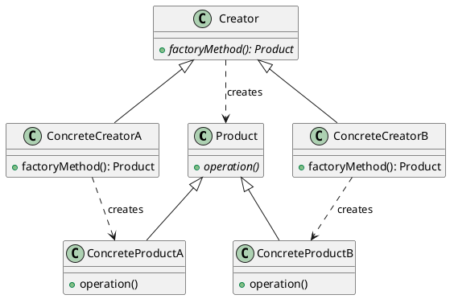

## Answer Key

### Q.1 Multiple Choice Questions

1.  c) Requirement Gathering
2.  b) To develop and maintain large software systems
3.  c) The system should allow users to create accounts.
4.  c) Interviews
5.  b) To ensure the requirements are correct and complete
6.  d) Code optimization
7.  c) Structural Model
8.  c) Use Case Diagram
9.  b) Behavioral Model
10. b) To automate software development from models
11. a) To provide reusable solutions to common architectural problems
12. b) Singleton

### Q.2

**A. Explain the different phases of the Software Development Life Cycle (SDLC) and their significance.**

**Answer:**

The Software Development Life Cycle (SDLC) is a structured process for producing high-quality software in a cost-effective and timely manner. It consists of several phases, each with specific goals and deliverables.

1.  **Requirement Gathering:**
    *   **Definition:** This initial phase involves collecting and documenting the needs of the stakeholders.
    *   **Significance:** Crucial for defining the scope of the project and ensuring that the software meets the intended purpose. Poorly gathered requirements lead to project failure.
2.  **Analysis:**
    *   **Definition:** Analyzing the gathered requirements to create a detailed understanding of the system's functionality.
    *   **Significance:** It helps in identifying potential issues, inconsistencies, and missing requirements. It also ensures that the requirements are feasible and can be implemented.
3.  **Design:**
    *   **Definition:** Translating the analyzed requirements into a detailed design of the software system. This includes architectural design, database design, interface design, and algorithm design.
    *   **Significance:** Provides a blueprint for the implementation phase. A well-defined design reduces the risk of errors and rework during implementation.
4.  **Implementation (Coding):**
    *   **Definition:** Writing the actual code based on the design specifications.
    *   **Significance:** This is where the software is built. Efficient coding practices and adherence to coding standards are essential for producing maintainable and reliable code.
5.  **Testing:**
    *   **Definition:** Verifying that the software meets the specified requirements and identifying any defects or bugs.
    *   **Significance:** Ensures the quality of the software. Different types of testing (unit, integration, system, acceptance) are performed to validate different aspects of the software.
6.  **Deployment:**
    *   **Definition:** Releasing the software to the end-users.
    *   **Significance:** Makes the software available for use. Proper deployment procedures are necessary to avoid disruptions and ensure a smooth transition.
7.  **Maintenance:**
    *   **Definition:** Addressing any issues that arise after deployment, including bug fixes, enhancements, and updates.
    *   **Significance:** Ensures the long-term usability and reliability of the software. Maintenance can be corrective, adaptive, perfective, or preventive.

**Significance of SDLC:**
The SDLC provides a structured approach to software development, reducing risks, improving quality, and ensuring that the software meets the needs of the stakeholders. Each phase is critical, and skipping or inadequately performing any phase can lead to significant problems later in the project.

**B. Describe the essential characteristics of a good Software Requirements Specification (SRS) document.**

**Answer:**

A Software Requirements Specification (SRS) document is a comprehensive description of the intended purpose and environment for software being developed. A good SRS should have the following characteristics:

1.  **Correct:**
    *   **Definition:** Every requirement stated in the SRS should be accurate and reflect what the client needs.
    *   **Significance:** Ensures that the system built is actually what the user wants.

2.  **Unambiguous:**
    *   **Definition:** Each requirement should have only one possible interpretation.
    *   **Significance:** Reduces confusion and prevents different developers from implementing the same requirement in different ways. Use of formal notations can help.

3.  **Complete:**
    *   **Definition:** The SRS should include all significant requirements, including functional, non-functional, and interface requirements.
    *   **Significance:** Ensures that all aspects of the system are covered. Missing requirements lead to incomplete software.

4.  **Consistent:**
    *   **Definition:** The requirements should not contradict each other.
    *   **Significance:** Prevents conflicting implementations. Conflicting requirements indicate a flaw in the requirement gathering or analysis phase.

5.  **Verifiable:**
    *   **Definition:** It should be possible to determine whether each requirement has been met.
    *   **Significance:** Enables effective testing and validation. Requirements that cannot be verified are difficult to implement and test.

6.  **Modifiable:**
    *   **Definition:** The SRS should be structured in such a way that changes can be made easily and consistently.
    *   **Significance:** Software requirements evolve. A well-structured SRS allows for easier updates and revisions.

7.  **Traceable:**
    *   **Definition:** Each requirement should be linked back to its source (e.g., stakeholder need) and forward to its implementation (e.g., design document, code module).
    *   **Significance:** Facilitates requirements management, impact analysis, and change control.

8.  **Ranked for Importance and/or Stability:**
    *   **Definition:** Requirements should be prioritized based on their importance to the customer and their expected stability.
    *   **Significance:** Helps in managing project scope and making trade-off decisions.

In summary, a good SRS serves as a contract between the development team and the stakeholders, ensuring that everyone has a clear and common understanding of what the software should do.

### Q.3

**A. Explain the different techniques used for requirements elicitation, highlighting their advantages and disadvantages.**

**Answer:**

Requirements elicitation is the process of discovering, gathering, and refining requirements for a system. Several techniques are used, each with its own advantages and disadvantages:

1.  **Interviews:**
    *   **Description:** One-on-one or group discussions with stakeholders to understand their needs and expectations.
    *   **Advantages:**
        *   Provides in-depth understanding of stakeholders' perspectives.
        *   Allows for clarification and follow-up questions.
        *   Can uncover hidden or implicit requirements.
    *   **Disadvantages:**
        *   Time-consuming and resource-intensive.
        *   Can be influenced by the interviewer's bias.
        *   Stakeholders may have difficulty articulating their needs.

2.  **Questionnaires:**
    *   **Description:** Distributing written questionnaires to a large group of stakeholders to gather information.
    *   **Advantages:**
        *   Efficient way to gather information from many people.
        *   Cost-effective.
        *   Provides quantitative data that can be analyzed easily.
    *   **Disadvantages:**
        *   Limited opportunity for follow-up questions.
        *   May not capture the nuances of stakeholders' needs.
        *   Low response rates can be a problem.

3.  **Workshops:**
    *   **Description:** Facilitated sessions involving stakeholders, developers, and other experts to collaboratively define requirements.
    *   **Advantages:**
        *   Promotes collaboration and shared understanding.
        *   Can resolve conflicts and identify common ground.
        *   Generates creative ideas and innovative solutions.
    *   **Disadvantages:**
        *   Requires careful planning and facilitation.
        *   Can be dominated by certain individuals or groups.
        *   Logistically challenging to organize.

4.  **Brainstorming:**
    *   **Description:** A group activity where participants generate a large number of ideas without criticism.
    *   **Advantages:**
        *   Encourages creativity and innovation.
        *   Simple and easy to conduct.
        *   Generates a wide range of potential requirements.
    *   **Disadvantages:**
        *   Can be difficult to manage and focus.
        *   May produce many irrelevant or infeasible ideas.
        *   Requires a skilled facilitator.

5.  **Use Cases:**
    *   **Description:** Describing the interactions between actors (users or external systems) and the system to achieve specific goals.
    *   **Advantages:**
        *   Provides a clear and structured way to capture functional requirements.
        *   Easy to understand by both stakeholders and developers.
        *   Helps in identifying potential scenarios and edge cases.
    *   **Disadvantages:**
        *   May not capture non-functional requirements effectively.
        *   Can be time-consuming to develop.
        *   Requires a good understanding of the system's domain.

6.  **Prototyping:**
    *   **Description:** Creating a preliminary version of the system to allow stakeholders to interact with it and provide feedback.
    *   **Advantages:**
        *   Helps stakeholders visualize the system and identify potential issues.
        *   Provides concrete feedback for developers.
        *   Reduces the risk of building the wrong system.
    *   **Disadvantages:**
        *   Can be time-consuming and expensive.
        *   Stakeholders may focus on superficial aspects of the prototype.
        *   May create unrealistic expectations.

**B. Describe the process of requirements validation and the various techniques used for it.**

**Answer:**

Requirements validation is the process of ensuring that the documented requirements accurately reflect the stakeholders' needs and expectations, and that they are complete, consistent, and feasible. It aims to verify that "we are building the right product."

**Process of Requirements Validation:**

1.  **Reviewing Requirements:**
    *   The initial step involves carefully examining the requirements document (SRS) to identify any errors, omissions, ambiguities, or inconsistencies.

2.  **Creating Validation Checklist:**
    *   Develop a checklist based on the characteristics of good requirements (correct, unambiguous, complete, consistent, verifiable, modifiable, traceable) to guide the validation process.

3.  **Involving Stakeholders:**
    *   Engage stakeholders, including users, customers, domain experts, and developers, in the validation process to get their feedback and perspectives.

4.  **Applying Validation Techniques:**
    *   Use various techniques to validate the requirements, such as reviews, prototyping, testing, and analysis.

5.  **Documenting Findings:**
    *   Record all issues, errors, and inconsistencies identified during the validation process.

6.  **Resolving Issues:**
    *   Work with stakeholders to resolve the identified issues and update the requirements document accordingly.

7.  **Obtaining Sign-off:**
    *   Once all issues have been resolved, obtain sign-off from the stakeholders to indicate their agreement with the validated requirements.

**Techniques for Requirements Validation:**

1.  **Requirements Reviews:**
    *   **Description:** A systematic examination of the requirements document by a team of reviewers to identify defects and inconsistencies.
    *   **Process:** Reviewers read the SRS, compare it against the validation checklist, and provide feedback.
    *   **Benefits:** Cost-effective, identifies many defects early in the development process.

2.  **Prototyping:**
    *   **Description:** Developing a preliminary version of the system to demonstrate the requirements to stakeholders and gather feedback.
    *   **Process:** Create a prototype based on the requirements, allow stakeholders to interact with it, and collect their feedback.
    *   **Benefits:** Helps stakeholders visualize the system, identifies missing or incorrect requirements.

3.  **Test Case Generation:**
    *   **Description:** Developing test cases based on the requirements to verify that they are testable and that the system will behave as expected.
    *   **Process:** Create test cases for each requirement, ensuring that the test cases can be executed and that they cover all aspects of the requirement.
    *   **Benefits:** Ensures that the requirements are verifiable, identifies ambiguous or untestable requirements.

4.  **Model Validation:**
    *   **Description:** Creating models of the system to analyze the requirements and identify potential issues.
    *   **Process:** Develop models such as data flow diagrams, state diagrams, or use case diagrams based on the requirements, and analyze the models for consistency and completeness.
    *   **Benefits:** Provides a visual representation of the requirements, identifies inconsistencies and gaps.

5.  **Acceptance Testing:**
    *   **Description:** Performing acceptance tests with stakeholders to verify that the system meets their needs and expectations.
    *   **Process:** Develop acceptance tests based on the requirements, execute the tests with stakeholders, and collect their feedback.
    *   **Benefits:** Ensures that the system is acceptable to the stakeholders, provides final validation of the requirements.

By employing these validation techniques, software engineers can ensure that the requirements are well-defined, accurate, and complete, leading to a successful software development project.

### Q.4 Solve any TWO of the following:

**A. Explain the purpose of Context Models and Interaction Models in system modeling, providing relevant examples.**

**Answer:**

**Context Models:**

*   **Purpose:** Context models define the boundary of the system and its relationships with its environment. They illustrate the system's dependencies on other systems, people, and external entities. They are used to understand the system's scope and its interactions with the outside world.
*   **Example:** Consider an online banking system. A context model would show that the system interacts with customers, bank employees, other banks, and credit agencies. It would also illustrate the flow of information (e.g., transaction requests, balance inquiries, credit reports) between the system and these external entities.
    *   The context model helps stakeholders understand the system's boundaries and external dependencies.

**Interaction Models:**

*   **Purpose:** Interaction models describe how users interact with the system and how different components of the system interact with each other. They are used to understand the system's functionality and the flow of information within the system.
*   **Example:** For the online banking system, an interaction model could be a use case diagram showing how a customer interacts with the system to perform tasks such as checking account balances, transferring funds, or paying bills. It could also be a sequence diagram showing how different components of the system (e.g., web server, application server, database server) interact to process a transaction.
    *   Interaction models help developers understand the system's behavior and design the user interface and system architecture.

In essence, context models define the "what" (what external entities interact with the system), while interaction models define the "how" (how users and system components interact).

**B. Describe the different types of UML diagrams used for Structural Modeling, including class diagrams and component diagrams, with examples.**

**Answer:**

Structural modeling in UML focuses on representing the static aspects of a system, illustrating its components and their relationships. Two key UML diagrams used for structural modeling are class diagrams and component diagrams.

**1. Class Diagrams:**

*   **Description:** Class diagrams represent the classes in a system, their attributes, and the relationships between them. Classes represent real-world entities or concepts, attributes define the characteristics of the classes, and relationships define how classes are associated with each other.
*   **Elements:**
    *   **Classes:** Represented as rectangles with three sections: name, attributes, and operations (methods).
    *   **Attributes:** Characteristics of a class (e.g., name, age, address).
    *   **Operations:** Actions that a class can perform (e.g., calculateSalary, deposit, withdraw).
    *   **Relationships:** Associations, aggregations, compositions, generalizations (inheritance), and dependencies.
*   **Example:** Consider an e-commerce system. A class diagram might include classes such as `Customer`, `Product`, `Order`, and `Payment`.
    *   `Customer` might have attributes like `name`, `address`, and `email`, and operations like `placeOrder` and `updateProfile`.
    *   `Product` might have attributes like `name`, `description`, and `price`.
    *   `Order` might have attributes like `orderDate` and `orderStatus`, and relationships with `Customer` and `Product`.
*   **Purpose:** Class diagrams help in visualizing the structure of the system, understanding the relationships between different entities, and designing the database schema.

**2. Component Diagrams:**

*   **Description:** Component diagrams represent the components of a system and their interfaces. Components are modular, deployable units of software that provide specific functionalities. Interfaces define the services that a component provides and requires.
*   **Elements:**
    *   **Components:** Represented as rectangles with a small component icon in the upper right corner.
    *   **Interfaces:** Represented as circles (provided interfaces) or half-circles (required interfaces).
    *   **Dependencies:** Represented as dashed arrows indicating the relationship between components.
*   **Example:** In the e-commerce system, components might include `AuthenticationService`, `ProductCatalog`, `ShoppingCart`, and `PaymentGateway`.
    *   `AuthenticationService` provides an interface for user authentication.
    *   `ProductCatalog` provides an interface for searching and browsing products.
    *   `ShoppingCart` provides an interface for managing the shopping cart.
    *   `PaymentGateway` provides an interface for processing payments.
*   **Purpose:** Component diagrams help in visualizing the architecture of the system, understanding the dependencies between different components, and designing the deployment strategy.

**C. Explain the concept of Behavioral Modeling with suitable examples, including state diagrams and activity diagrams.**

**Answer:**

Behavioral modeling focuses on describing the dynamic aspects of a system, illustrating how it responds to events and changes over time. It helps in understanding the system's behavior and designing its control logic. Two key UML diagrams used for behavioral modeling are state diagrams and activity diagrams.

**1. State Diagrams:**

*   **Description:** State diagrams represent the different states that an object can be in and the transitions between those states. States represent a condition or situation in which an object exists, and transitions represent the events that cause the object to move from one state to another.
*   **Elements:**
    *   **States:** Represented as rounded rectangles.
    *   **Transitions:** Represented as arrows labeled with the event that triggers the transition.
    *   **Initial State:** Represented as a filled circle.
    *   **Final State:** Represented as a circle containing a filled circle.
*   **Example:** Consider a simple `Order` object in an e-commerce system. The `Order` can be in states such as `Created`, `Submitted`, `Processing`, `Shipped`, and `Delivered`.
    *   The `Order` starts in the `Created` state.
    *   When the customer submits the order, it transitions to the `Submitted` state.
    *   When the order is processed, it transitions to the `Processing` state.
    *   When the order is shipped, it transitions to the `Shipped` state.
    *   Finally, when the order is delivered, it transitions to the `Delivered` state.
*   **Purpose:** State diagrams help in visualizing the lifecycle of an object, understanding the possible states it can be in, and designing the control logic for managing state transitions.

**2. Activity Diagrams:**

*   **Description:** Activity diagrams represent the flow of activities in a system. Activities represent tasks or actions that are performed, and the diagram shows the sequence in which these activities are executed.
*   **Elements:**
    *   **Activities:** Represented as rounded rectangles.
    *   **Transitions:** Represented as arrows indicating the flow of control.
    *   **Initial Node:** Represented as a filled circle.
    *   **Final Node:** Represented as a circle containing a filled circle.
    *   **Decision Nodes:** Represented as diamonds, indicating branching points in the flow.
    *   **Fork and Join Nodes:** Represented as horizontal or vertical bars, indicating parallel execution of activities.
*   **Example:** Consider the process of placing an order in an e-commerce system.
    *   The activity diagram might start with the activity "Browse Products."
    *   The next activity might be "Add Products to Cart."
    *   Then, there could be a decision node to check if the customer is logged in.
    *   If not, the activity "Login" is performed.
    *   Next, the activity "Enter Shipping Address" is performed.
    *   Then, the activity "Enter Payment Information" is performed.
    *   Finally, the activity "Confirm Order" is performed.
*   **Purpose:** Activity diagrams help in visualizing the workflow of a system, understanding the sequence of activities, and designing the process logic.

### Q.5 Solve any TWO of the following:

**A. What are the key considerations when making architectural design decisions? Explain with examples.**

**Answer:**

Architectural design decisions are crucial for the success of a software project as they define the overall structure and organization of the system. Key considerations when making these decisions include:

1.  **Functionality:**
    *   **Consideration:** The architecture must support the required functionality of the system.
    *   **Example:** If the system needs to handle real-time data processing, an architecture based on message queues and event-driven processing might be appropriate. If the system is primarily for data storage and retrieval, a database-centric architecture might be more suitable.

2.  **Performance:**
    *   **Consideration:** The architecture must meet the performance requirements of the system, such as response time, throughput, and scalability.
    *   **Example:** For a high-traffic website, a distributed architecture with load balancing and caching mechanisms can improve performance. For a computationally intensive application, parallel processing and optimized algorithms can be used.

3.  **Reliability:**
    *   **Consideration:** The architecture must ensure the reliability of the system, including availability, fault tolerance, and data integrity.
    *   **Example:** Redundant servers and data replication can improve availability. Error handling and data validation can ensure data integrity.

4.  **Security:**
    *   **Consideration:** The architecture must address the security concerns of the system, such as authentication, authorization, and data protection.
    *   **Example:** Using secure communication protocols (e.g., HTTPS), implementing access control mechanisms, and encrypting sensitive data can enhance security.

5.  **Scalability:**
    *   **Consideration:** The architecture must allow the system to scale to handle increasing workloads and user demands.
    *   **Example:** A microservices architecture allows individual services to be scaled independently. Cloud-based infrastructure provides on-demand scalability.

6.  **Maintainability:**
    *   **Consideration:** The architecture must be easy to maintain, modify, and evolve over time.
    *   **Example:** Modular design, well-defined interfaces, and clear coding standards can improve maintainability.

7.  **Cost:**
    *   **Consideration:** The architecture must be cost-effective, considering development, deployment, and operational costs.
    *   **Example:** Using open-source technologies, leveraging cloud services, and optimizing resource utilization can reduce costs.

8.  **Technology Constraints:**
    *   **Consideration:** The architecture must take into account the available technologies, tools, and expertise.
    *   **Example:** Choosing a programming language and framework that the development team is familiar with. Selecting a database that meets the system's requirements and is supported by the available infrastructure.

By carefully considering these factors, architects can make informed decisions that lead to a robust, scalable, and maintainable system.

**B. Describe the layered architectural style and its advantages. How does it differ from the client-server architecture?**

**Answer:**

**Layered Architectural Style:**

*   **Description:** The layered architectural style organizes the system into a hierarchy of layers, each providing a specific set of services. Each layer only interacts with the layer directly below it, and each layer has a well-defined responsibility.
*   **Layers:** Common layers include presentation layer (UI), application layer (business logic), data access layer, and database layer.
*   **Example:** A typical e-commerce application might have a presentation layer for handling user interaction, an application layer for implementing business logic (e.g., order processing, inventory management), a data access layer for accessing the database, and a database layer for storing data.

**Advantages of Layered Architecture:**

1.  **Modularity:** Each layer is a self-contained module with a specific responsibility, making the system easier to understand, develop, and maintain.
2.  **Reusability:** Layers can be reused across different parts of the system or in other systems.
3.  **Maintainability:** Changes in one layer do not affect other layers, as long as the interfaces between layers remain the same.
4.  **Testability:** Each layer can be tested independently, making it easier to verify the correctness of the system.
5.  **Flexibility:** Layers can be replaced or upgraded without affecting other layers.

**Difference from Client-Server Architecture:**

*   **Layered Architecture:** Organizes the system into a hierarchy of layers within a single application or system. Communication is typically vertical, with each layer interacting with the layer directly below it.
*   **Client-Server Architecture:** Distributes the system into two distinct parts: a client (which requests services) and a server (which provides services). Communication is typically between the client and the server, often over a network.
*   **Key Difference:** Layered architecture focuses on organizing the components within a single system, while client-server architecture focuses on distributing the system across multiple machines.

**C. Explain the importance of design patterns in software architecture. Discuss the Model-View-Controller (MVC) architectural pattern with an example.**

**Answer:**

**Importance of Design Patterns in Software Architecture:**

Design patterns are reusable solutions to commonly occurring problems in software design. They provide a proven approach to solving design challenges, promoting code reuse, improving maintainability, and enhancing the overall quality of the software architecture.

*   **Code Reusability:** Design patterns offer pre-defined solutions, reducing the need to "reinvent the wheel" for common problems.
*   **Improved Communication:** Design patterns provide a common vocabulary for developers, making it easier to communicate design ideas and solutions.
*   **Enhanced Maintainability:** Design patterns promote modularity and separation of concerns, making the codebase easier to understand, modify, and maintain.
*   **Proven Solutions:** Design patterns are based on tried-and-tested approaches, reducing the risk of design flaws and improving the reliability of the system.

**Model-View-Controller (MVC) Architectural Pattern:**

*   **Description:** MVC is a widely used architectural pattern for developing user interfaces that divides the application into three interconnected parts: Model, View, and Controller.
*   **Components:**
    *   **Model:** Represents the data and business logic of the application. It manages the data and provides methods for accessing and manipulating it.
    *   **View:** Represents the user interface of the application. It displays the data from the model and provides a way for the user to interact with the application.
    *   **Controller:** Acts as an intermediary between the model and the view. It receives user input from the view, updates the model, and selects the appropriate view to display.
*   **Example:** Consider a simple web application for managing a list of tasks.
    *   **Model:** The model might include classes such as `Task` and `TaskList`, which store the task data and provide methods for adding, deleting, and updating tasks.
    *   **View:** The view might be an HTML page that displays the list of tasks and provides input fields for adding new tasks.
    *   **Controller:** The controller might receive user input from the view (e.g., a request to add a new task), update the model (e.g., add the task to the `TaskList`), and then update the view to display the updated list of tasks.
*   **Benefits:**
    *   **Separation of Concerns:** MVC promotes separation of concerns, making the application easier to understand, develop, and maintain.
    *   **Reusability:** The model and view can be reused across different parts of the application.
    *   **Testability:** Each component can be tested independently.
    *   **Flexibility:** The view can be easily changed without affecting the model or controller.

### Q.6 Solve any TWO of the following:

**A. Explain the Factory design pattern with a UML diagram and a code snippet.**

**Answer:**

**Factory Design Pattern:**

*   **Description:** The Factory design pattern is a creational pattern that provides an interface for creating objects but allows subclasses to alter the type of objects that will be created. It encapsulates object creation logic, making the code more flexible and maintainable.
*   **Purpose:** To decouple the client code from the concrete classes of the objects it needs to create. This allows you to add new object types without modifying the client code.
*   **Components:**
    *   **Product:** Defines the interface of objects the factory method creates.
    *   **ConcreteProduct:** Implements the Product interface.
    *   **Creator:** Declares the factory method, which returns an object of type Product. The Creator may also define a default implementation of the factory method.
    *   **ConcreteCreator:** Overrides the factory method to return an instance of a ConcreteProduct.

**UML Diagram:**



**Code Snippet (Python):**

```python
from abc import ABC, abstractmethod

class Product(ABC):
    @abstractmethod
    def operation(self):
        pass

class ConcreteProductA(Product):
    def operation(self):
        return "ConcreteProductA"

class ConcreteProductB(Product):
    def operation(self):
        return "ConcreteProductB"

class Creator(ABC):
    @abstractmethod
    def factory_method(self):
        pass

    def some_operation(self):
        product = self.factory_method()
        return f"Creator: The same creator's code has just worked with {product.operation()}"

class ConcreteCreatorA(Creator):
    def factory_method(self):
        return ConcreteProductA()

class ConcreteCreatorB(Creator):
    def factory_method(self):
        return ConcreteProductB()

# Client code
def client_code(creator):
    print(f"Client: I'm not aware of the creator's class, but it still works.\n"
          f"{creator.some_operation()}", end="")

creator1 = ConcreteCreatorA()
client_code(creator1)
print("\n")

creator2 = ConcreteCreatorB()
client_code(creator2)
```

**Explanation:**

The `Product` class defines the interface for the objects that the factory will create. `ConcreteProductA` and `ConcreteProductB` are concrete implementations of the `Product` interface. The `Creator` class defines the abstract `factory_method` that subclasses must implement to create specific products. `ConcreteCreatorA` and `ConcreteCreatorB` implement the `factory_method` to create instances of `ConcreteProductA` and `ConcreteProductB`, respectively. The client code works with the `Creator` interface, allowing it to create different types of products without knowing their concrete classes.

**B. Describe the Observer design pattern and its benefits in decoupling components. Provide a real-world example.**

**Answer:**

**Observer Design Pattern:**

*   **Description:** The Observer design pattern is a behavioral pattern that defines a one-to-many dependency between objects, so that when one object (the subject) changes state, all its dependents (the observers) are notified and updated automatically.
*   **Purpose:** To decouple the subject from its observers, allowing them to vary independently. This promotes loose coupling, making the system more flexible and maintainable.
*   **Components:**
    *   **Subject:** Maintains a list of observers and provides methods for adding and removing observers. It also provides a method for notifying observers of state changes.
    *   **Observer:** Defines the interface for objects that want to be notified of state changes in the subject.
    *   **ConcreteSubject:** Extends the Subject and contains the state that observers are interested in.
    *   **ConcreteObserver:** Implements the Observer interface and receives notifications from the subject.

**Benefits in Decoupling Components:**

1.  **Loose Coupling:** The subject and observers are loosely coupled, meaning that they do not depend on each other's concrete classes.
2.  **Flexibility:** The number and types of observers can be changed dynamically without affecting the subject.
3.  **Reusability:** The subject and observers can be reused in different contexts.
4.  **Scalability:** New observers can be added easily without modifying the subject.

**Real-World Example:**

*   **Social Media Notifications:**
    *   **Subject:** A user's profile on a social media platform (e.g., Facebook, Twitter).
    *   **Observers:** Other users who follow the profile or have subscribed to receive updates.
    *   **Scenario:** When the user posts a new status update, uploads a photo, or changes their profile information, the subject (user's profile) notifies all its observers (followers) of the change.
    *   **Benefits:** The user's profile does not need to know the specific details of how each follower wants to be notified. Some followers may want to receive email notifications, while others may want to see the updates in their news feed. The Observer pattern allows the user's profile to notify all followers without being tightly coupled to their notification preferences.

**C. Discuss the challenges of implementing design patterns in legacy systems and strategies to overcome them.**

**Answer:**

Implementing design patterns in legacy systems can be challenging due to the existing codebase's complexity, lack of documentation, and potential for introducing new bugs.

**Challenges:**

1.  **Code Complexity:** Legacy systems often have complex and poorly structured code, making it difficult to identify opportunities for applying design patterns.
2.  **Lack of Documentation:** Many legacy systems lack proper documentation, making it hard to understand the system's design and functionality.
3.  **Technical Debt:** Legacy systems often have accumulated technical debt over time, making it difficult to make changes without introducing new bugs.
4.  **Resistance to Change:** Developers may be reluctant to make changes to legacy systems due to fear of breaking existing functionality.
5.  **Limited Resources:** Implementing design patterns may require significant time and effort, which may not be available in legacy system projects.

**Strategies to Overcome Challenges:**

1.  **Refactoring:** Refactor the code incrementally to improve its structure and readability. This makes it easier to identify opportunities for applying design patterns.
2.  **Reverse Engineering:** Use reverse engineering techniques to understand the system's design and functionality. This can involve analyzing the code, examining the database schema, and interviewing developers.
3.  **Testing:** Implement thorough testing to ensure that changes do not introduce new bugs. This can involve unit testing, integration testing, and system testing.
4.  **Small Steps:** Apply design patterns in small, incremental steps. This reduces the risk of introducing new bugs and makes it easier to revert changes if necessary.
5.  **Collaboration:** Work closely with developers who have experience with legacy systems and design patterns. This can help in identifying the best approach for applying design patterns in the specific context of the legacy system.
6.  **Documentation:** Document the changes made to the system, including the design patterns that were applied and the reasons for applying them. This helps in maintaining the system over time.
7.  **Training:** Provide training to developers on design patterns and refactoring techniques. This helps in building the skills needed to apply design patterns effectively in legacy systems.